# 游戏任务系统

## 问题引入

游戏玩法中存在任务驱动的行为，例如任务系统、关卡解密、新手引导等，当任务驱动情况复杂且需要涉及网络同步、序列化等时会导致硬编码的逻辑分散且难以理解（异步编程的常见问题），而若把任务逻辑完全硬编码后给设计师配置数值会导致配置表字段暴涨（出现非常多的只针对特例的变量），且设计师修改流程是要经过程序开发

## 目标

提供一套编辑器及运行时的工具支持游戏任务的编写，能让设计师快速方便的配置任务条件，且可脚本化地配置任务间的关联关系

## 系统概述

拓展了蓝图系统，增加了游戏任务图表，该图表中可添加任务序列（序列中包含任务元素），任务序列之间的跳转关系可额外编写逻辑，用蓝图节点的形式编写游戏任务

## 具体概念

### 任务图

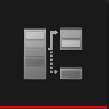  
用来定义单个任务的流程  

### 任务序列

任务元素的容器，多个任务组元素合成任务序列，元素满足序列完成条件则会进行下一个序列  

#### 序列逻辑类型

1. 单一序列  
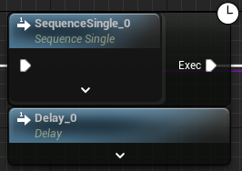  
只能容纳一个判定条件，条件通过则完成
2. 列表序列  
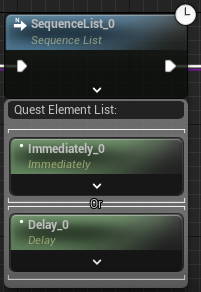  
可容纳多个判定条件，当列表中的条件满足达成情况时完成
3. 分支序列  
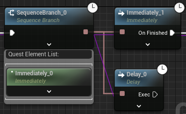  
列表中的元素满足完成条件后会激活分支，若分支完成进行分支后的序列（分支序列中有选择是否中断其它分支，若不中断其它分支则当其他分支结束后会执行对应分支的后继序列）
4. 子任务序列  
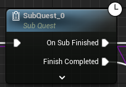  
子任务中配置的QuestRerouteTag会创建当序列后继执行的引脚
    > 若想实现循环的流程也可用子任务节点激活自身，用递归的任务形式达成流程循环  

C++可配置GameQuestGraphEditorSettings中的序列类型定制序列属性与行为

#### 组

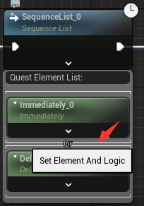  
元素可分为多组，同一组的元素为与逻辑，组之间为或逻辑  

#### 可选元素

标记为可选的元素`不会对序列的完成情况造成影响`

### 任务元素

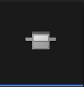  
元素就是任务的判定条件，用户可根据需求实现游戏中不同的判定逻辑  

#### 拓展用函数

| 可重写函数                  | 说明                    |
|------------------------|-----------------------|
| WhenElementActivated   | 当元素激活时触发，例如用来绑定委托     |
| WhenElementDeactivated | 当元素反激活时触发，例如用来取消绑定的委托 |
| WhenTick               | Tick事件，需要配置Tiackable为true后才能调用 |
| WhenForceFinishElement | 使用控制台或者调试按钮强制完成元素时，将状态设置为任务完成时的 |

| 函数及变量                | 说明                                              |
|----------------------|-------------------------------------------------|
| GameQuestFinishEvent | 用作任务结束时的触发，任务分支节点会出现变量名对应的执行引脚                  |
| FinishElement        | 设置该元素已经结束，传入GameQuestFinishEvent触发对应的后继任务       |
| UnfinishedElement    | 设置该元素尚未结束（例如搜集物品的情景，原本已经搜集完成，但是玩家卖了些导致又回到未完成状态） |

* 蓝图拓展继承GameQuestElementScriptable
* C++拓展继承GameQuestElementBase

> 假如全使用C++的任务元素，可以极大的减少UObject的数量，理想情况一个任务图创建的UObject就是图自身

#### 变量暴露为节点的引脚

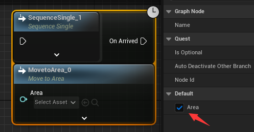  
元素内声明的属性带有ExposeOnSpawn的标记则可暴露为引脚，通过调用`GetEvaluateGraphExposedInputs`解算任务图中的输入

#### 本地判定

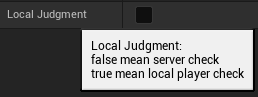  
由于存在一些情况任务的判定只能在客户端计算（例如输入行为等），添加了可主端判定是否完成的选项

* 为真时任务元素会在`主控端`激活
* 只有在任务元素在主控端激活的情况下才能向服务器发送元素结束的RPC请求

#### 示例

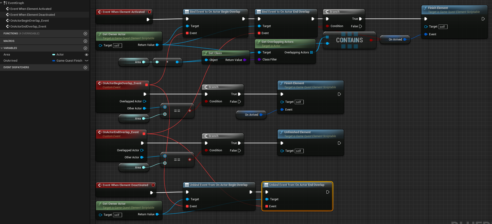  
声明了`Area`变量，`OnArrved`完成事件  
当`激活`时

* 向所有者`绑定`了Overlap事件，用于检查是否在区域内，Begin时完成，End时取消完成  
* 检查所有者是否已经在Area内了，为真则直接完成元素

当`反激活`  

* `取消绑定`所有者的Overlap事件

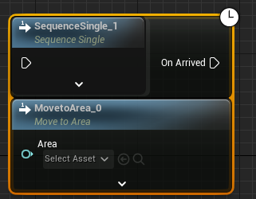  

定义完的任务元素可在任务序列中创建

#### 支持图表类型

考虑到`任务元素`可能对应不同的`上下文`（世界的任务、角色的任务、队伍的任务...），这将会对应不同的`任务图表基类`，所以添加了`支持图表类型`的概念，任务元素只可在支持的图表中创建  

### 中断

* `InterruptQuest`中断整个任务  
* `InterruptNodeByRef`中断指定的任务节点，若对应节点已经完成，则中断后继激活节点  

### 自定义入口

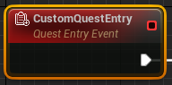  

CustomQuestEntry可创建额外的任务启动入口，可用作同一个任务图的不同的开始流程

### 重路由标签

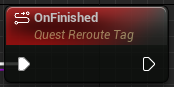  

QuestRerouteTag一般用作声明子任务完成时的后续逻辑引脚，相同Tag名的引脚只会执行一次

## 游戏任务编辑器  

### 调试

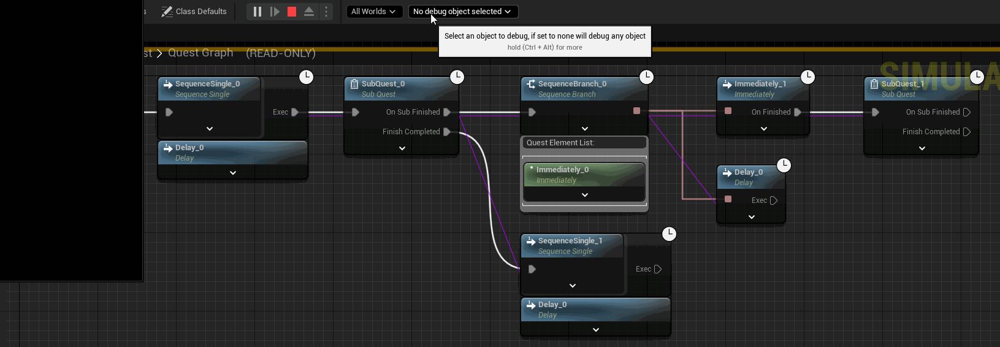  
调试支持所有的蓝图调试操作，且标注了节点的当前状态  

* 紫色连线表示任务序列之间的关联关系
* 黄色箭头代表任务流程走向

| 节点状态 | 对应颜色 |
|------|------|
| 激活   | 绿色   |
| 未激活  | 黑色   |
| 完成   | 蓝色   |
| 中断   | 红色   |

* 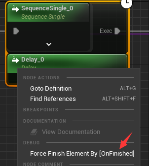  
调试时右键激活的节点可以强制完成

* 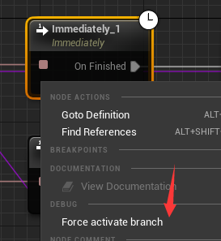  
调试服务端对象时右键未完成的节点可强制跳转执行该节点  

* 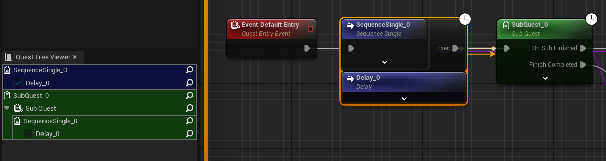  
面板可用 Window - Quest Tree Viewer 打开
游戏任务调试面板会显示当前调试的任务树，点击可跳转到对应节点

#### 命令行强制完成

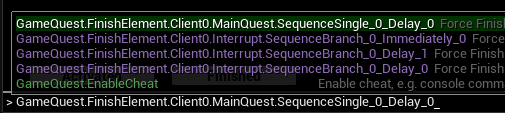  

* 总控：  
  GameQuest.EnableCheat <0:关闭/1:打开>（非Shipping模式默认打开）
* 强制完成元素  
  PIE模式格式：GameQuest.FinishElement.\<Server/Client0>.<游戏任务类型名>.<任务元素全名>  
  非PIE模式格式：GameQuest.FinishElement.\<游戏任务类型名>.<任务元素全名>

## 运行时

* 提供了GameQuestComponent组件管理任务图表，调用**AddQuest**节点添加游戏任务  
* 该系统运行时Element提供Tick任务，需要勾选**Tickable**后，才会在节点**激活**时执行Tick

### 运行时UI

提供了`GameQuestTreeList`UMG控件支持任务树的运行时显示  
可配置控件类型拓展面板的显示方式  
