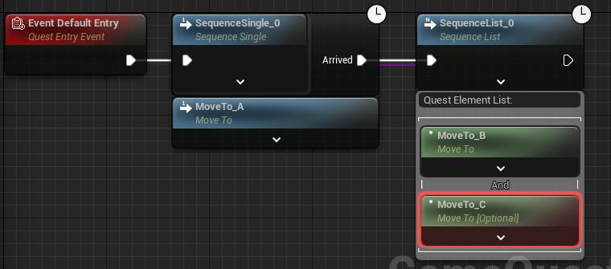
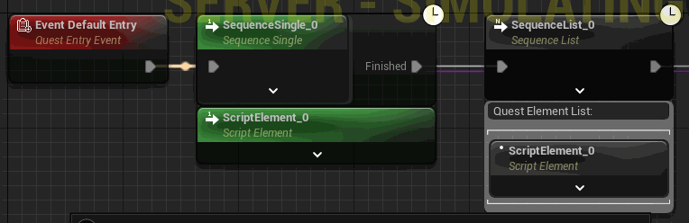

# Game Quest Graph

[中文](README_ZH.md) | [English](README.md)

## System Overview

Expand the blueprint system, add a new game quest graph, which can add multiple quest stages (quest sequences) and the completion conditions of each node (quest elements) in the graph. The jump relationship between quest stages can be written in blueprint logic.

### Features

* Blueprints can control the quest process
* Blueprints can dynamically set quest parameters
* Support network synchronization

## Usage Steps

1. Add the quest management component in the appropriate Actor, such as adding `GameQuestComponent` in PlayerController
2. Create a quest graph, start from DefaultEntry to add quest judgment conditions and write quest processes
    * Searching for `add quest ...` will display nodes that can be added
    * Right-click on the sequence node and select the `Add Quest Element` tab to add task elements
    * If there is no judgment condition that meets the requirements, inherit the quest element base class to customize the judgment condition
3. Activate the written quest from `GameQuestComponent` by calling `AddQuest`

### Example

  

When quest activated（DefaultEntry）

1. Player should move to point A(MoveTo_A)
2. When the player reaches point A, the player is required to reach point B (MoveTo_B) and optionally reach point C (MoveTo_C)
3. When the player reaches point B, quest finished

* Play this quest
  

## Specific Concepts

### Quest Graph

  
Used to define the process of a single quest

### Quest Sequence

The container of quest elements, multiple quest group elements form a quest sequence, and the elements meet the sequence completion conditions to proceed to the next sequence

#### Sequence Logic Types

1. Single sequence  
  
Can only accommodate one judgment condition, and when the condition finished mean sequence is completed
2. List sequence  
  
Can accommodate multiple judgment conditions, and when conditions in the list are finished mean sequence is completed
3. Branch sequence  
  
The elements in the list will activate branches after meeting the completion conditions. If the branch is completed, the sequence after the branch will be performed (there is a choice in the branch sequence whether to interrupt other branches, if not interrupting other branches, the corresponding successor sequence will be executed after the other branches end)
4. Sub-quest sequence  
  
The QuestRerouteTag configured in the sub-quest will create the pin for the subsequent execution of the sequence
    > If you want to implement a `loop` process, you can also use the sub-quest node to activate itself, and use the recursive activation of sub-quests to achieve the loop of the same quest process

C++ can configure the sequence types in GameQuestGraphEditorSettings to customize sequence attributes and behavior

#### Group

  

* Elements can be divided into multiple groups, and the elements in the same group are and logic, and the groups are or logic
* Clicking the And or Or button between elements can switch the logic

#### Optional Elements

Elements marked as optional `will not affect the completion of the sequence`

### Quest Element

  

The element is the judgment condition of the quest, and users can expand the element to implement different judgment logic according to needs

#### Extension Functions

* Blueprint inherits GameQuestElementScriptable
* C++ inherits GameQuestElementBase

| Overridable Functions   | Description                                                                                                                                                                                                                                  |
|-------------------------|----------------------------------------------------------------------------------------------------------------------------------------------------------------------------------------------------------------------------------------------|
| WhenElementActivated    | Triggered when the element is activated, such as binding a delegate                                                                                                                                                                          |
| WhenElementDeactivated  | Triggered when the element is deactivated, such as unbinding the delegate                                                                                                                                                                    |
| WhenTick                | Tick event, triggered only when Tiackable is true                                                                                                                                                                                            |
| WhenForceFinishElement  | Triggered when the element is forcibly completed using the console or debug button, the world state needs to be set to the situation when the quest is completed to prevent Debug from jumping to the quest and causing abnormal world state |

| Functions and Variables | Description                                                                                                                                                                                 |
|-------------------------|---------------------------------------------------------------------------------------------------------------------------------------------------------------------------------------------|
| GameQuestFinishEvent    | The event name when the quest is completed, the single sequence and branch sequence nodes will have the variable name corresponding to the execution pin                                    |
| FinishElement           | Set the element to be completed, pass in GameQuestFinishEvent to trigger the corresponding subsequent quests                                                                                |
| UnfinishedElement       | Set the element to be unfinished (for example, the scene of collecting items, the player has completed the collection, but the player sells some items and returns to the unfinished state) |

> If all C++ quest elements are used, the number of UObject can be greatly reduced. In an ideal case, only one UObject is created for a quest graph

#### Variables Exposed as Node Pins

  
Properties declared in the element with the `ExposeOnSpawn` tag can be exposed as pins, and the input in the quest graph can be solved by calling `GetEvaluateGraphExposedInputs`

#### Local Judgment

  
Since there are some situations where the quest judgment can only be calculated on the client side (such as input behavior, etc.), an option for the autonomous to determine whether it is completed has been added

* When true, the quest element will be activated on the `autonomous`
* Only when the quest element is activated on the autonomous can the RPC request for element completion be sent to the server

#### Quest Element Class Example

  
Declare the `Area` variable (if the client-side UI needs to be displayed, it can be marked as network synchronization), and the `OnArrved` completion event.
When `activated`:

* `Bind` the overlap event to the owner to check if it is in the area, complete when Begin, and cancel completion when End
* Check if the owner is already in the Area, if true, complete the element directly

When `deactivated`:

* `Unbind` the owner's overlap event

  

The defined quest element can be created in the quest sequence

#### Supported Graph Types

Considering that `quest elements` may correspond to different `contexts` (world quests, character quests, team quests...), this will correspond to different `quest graph base classes`, so the concept of `supported graph types` is added, and quest elements can only be created in supported graphs.

### Interruption

The concept of interruption can implement the situation where the quest fails in the game, such as the quest cannot be completed due to changes in the world state

* `InterruptQuest` interrupts the entire quest
* `InterruptNodeByRef` interrupts the specified quest node, if the corresponding node has been completed, the subsequent activated node will be interrupted

### Custom Entry

  

CustomQuestEntry can create additional quest start entries, which can be used for different start processes of the same quest graph

### Reroute Tag

  

QuestRerouteTag is generally used to declare the subsequent logic pin when the sub-quest is completed, and the pins with the same Tag name will only be executed once

## Game Quest Editor

### Debugging

  
Debugging supports all blueprint debugging operations and marks the current state of the node

* Purple lines represent the association relationship between quest sequences
* Yellow arrows represent the direction of the quest process

| Node State  | Corresponding Color |
|-------------|---------------------|
| Activated   | Green               |
| Deactivated | Black               |
| Completed   | Blue                |
| Interrupted | Red                 |

*   
During debugging, right-click the activated node to force completion

*   
Right-click the unfinished node when debugging the server-side object to force the node to execute

*   
The panel can be opened with Window - Quest Tree Viewer
The game quest debug panel will display the current debug quest tree, and clicking will jump to the corresponding node

#### Console Command Forced Completion

  

* Master control:
  GameQuest.EnableCheat <0: off/1: on> (default on for non-Shipping mode)
* Force completion of elements
  PIE mode format: GameQuest.FinishElement.\<Server/Client0>.\<Game quest type name>.\<Quest element full name>
  Non-PIE mode format: GameQuest.FinishElement.\<Game quest type name>.\<Quest element full name>

### Runtime UI

Provides `GameQuestTreeList` UMG control to support the runtime display of the quest tree
You can configure the control type to extend the display mode of the panel
