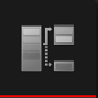
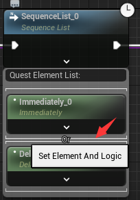
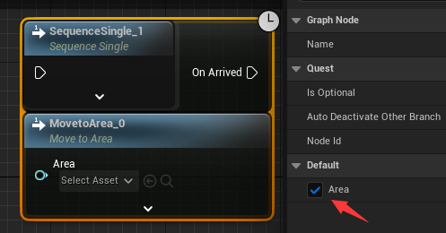
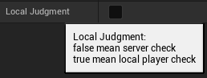
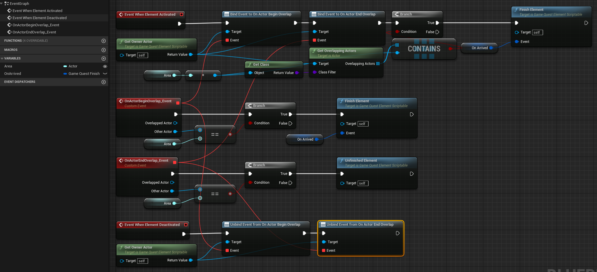
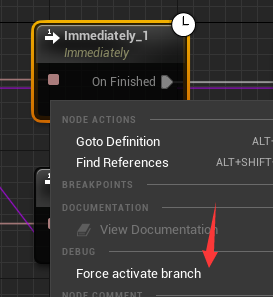
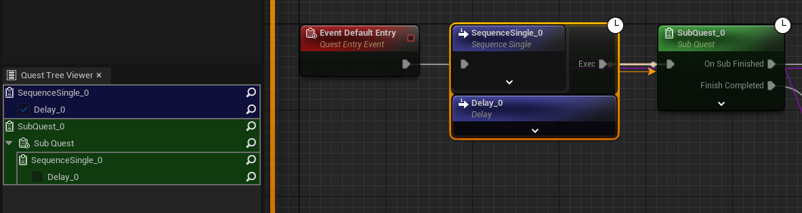

# 游戏任务图

[中文](README_ZH.md) | [English](README.md)

## 系统概述

拓展蓝图系统，新增游戏任务图，该图中可添加多个任务阶段（任务序列）与每个节点的完成条件（任务元素），任务阶段之间的跳转关系可编写蓝图逻辑  

### 特性

* 蓝图可控制任务流程
* 蓝图可动态设置任务参数
* 支持网络同步

## 使用步骤

1. 在合适的Actor中添加任务的管理组件，例如在PlayerController中添加`GameQuestComponent`
2. 创建任务图，从DefaultEntry开始添加任务判定条件编写任务流程
    * 若没有满足需求的判定条件，则继承任务元素自定义判定条件
3. 从`GameQuestComponent`调用`AddQuest`激活编写的任务

## 具体概念

### 任务图

  
用来定义单个任务的流程  

### 任务序列

任务元素的容器，多个任务组元素合成任务序列，元素满足序列完成条件则会进行下一个序列  

#### 序列逻辑类型

1. 单一序列  
  
只能容纳一个判定条件，条件通过则完成
2. 列表序列  
  
可容纳多个判定条件，当列表中的条件满足达成情况时完成
3. 分支序列  
  
列表中的元素满足完成条件后会激活分支，若分支完成进行分支后的序列（分支序列中有选择是否中断其它分支，若不中断其它分支则当其他分支结束后会执行对应分支的后继序列）
4. 子任务序列  
  
子任务中配置的QuestRerouteTag会创建当序列后继执行的引脚
    > 若想实现`循环`的流程也可用子任务节点激活自身，用递归激活子任务的形式实现相同任务流程的循环  

C++可配置GameQuestGraphEditorSettings中的序列类型定制序列属性与行为

#### 组

  
元素可分为多组，同一组的元素为与逻辑，组之间为或逻辑  

#### 可选元素

标记为可选的元素`不会对序列的完成情况造成影响`

### 任务元素

  

元素为任务的判定条件，用户可根据需求拓展元素实现不同的判定逻辑  

#### 拓展用函数

* 蓝图继承GameQuestElementScriptable
* C++继承GameQuestElementBase

| 可重写函数                  | 说明                    |
|------------------------|-----------------------|
| WhenElementActivated   | 当元素激活时触发，例如用来绑定委托     |
| WhenElementDeactivated | 当元素反激活时触发，例如用来取消绑定的委托 |
| WhenTick               | Tick事件，需要Tiackable为true时才会触发 |
| WhenForceFinishElement | 使用控制台或调试按钮强制完成元素时触发，需要将世界状态设置为任务完成时的情况，防止Debug跳转任务引发世界状态异常 |

| 函数及变量                | 说明                                              |
|----------------------|-------------------------------------------------|
| GameQuestFinishEvent | 任务完成时的事件名，单一序列与分支序列节点会出现变量名对应的执行引脚                  |
| FinishElement        | 设置该元素已经结束，传入GameQuestFinishEvent触发对应的后继任务       |
| UnfinishedElement    | 设置该元素尚未结束（例如搜集物品的情景，原本已经搜集完成，但是玩家卖了些导致又回到未完成状态） |

> 假如全使用C++的任务元素，可以极大的减少UObject的数量，理想情况一个任务图只创建一个UObject

#### 变量暴露为节点引脚

  
元素内声明的属性带有`ExposeOnSpawn`的标记则可暴露为引脚，通过调用`GetEvaluateGraphExposedInputs`解算任务图中的输入

#### 本地判定

  
由于存在一些情况任务的判定只能在客户端计算（例如输入行为等），添加了可主端判定是否完成的选项

* 为真时任务元素会在`主控端`激活
* 只有在任务元素在主控端激活的情况下才能向服务器发送元素结束的RPC请求

#### 示例

  
声明了`Area`变量（客户端UI要显示的话可标记网络同步），`OnArrved`完成事件  
当`激活`时

* 向所有者`绑定`了Overlap事件，用于检查是否在区域内，Begin时完成，End时取消完成  
* 检查所有者是否已经在Area内了，为真则直接完成元素

当`反激活`  

* `取消绑定`所有者的Overlap事件

  

定义完的任务元素可在任务序列中创建

#### 支持图类型

考虑到`任务元素`可能对应不同的`上下文`（世界的任务、角色的任务、队伍的任务...），这将会对应不同的`任务图基类`，所以添加了`支持图类型`的概念，任务元素只可在支持的图中创建  

### 中断

中断的概念可实现游戏玩法中任务失败的情况，比如因世界状态改变导致该任务无法完成

* `InterruptQuest`中断整个任务  
* `InterruptNodeByRef`中断指定的任务节点，若对应节点已经完成，则中断后继激活节点  

### 自定义入口

  

CustomQuestEntry可创建额外的任务启动入口，可用作同一个任务图的不同的开始流程

### 重路由标签

  

QuestRerouteTag一般用作声明子任务完成时的后续逻辑引脚，相同Tag名的引脚只会执行一次

## 游戏任务编辑器  

### 调试

  
调试支持所有的蓝图调试操作，且标注了节点的当前状态  

* 紫色连线表示任务序列之间的关联关系
* 黄色箭头代表任务流程走向

| 节点状态 | 对应颜色 |
|------|------|
| 激活   | 绿色   |
| 未激活  | 黑色   |
| 完成   | 蓝色   |
| 中断   | 红色   |

*   
调试时右键激活的节点可以强制完成

*   
调试服务端对象时右键未完成的节点可强制跳转执行该节点  

*   
面板可用 Window - Quest Tree Viewer 打开
游戏任务调试面板会显示当前调试的任务树，点击可跳转到对应节点

#### 命令行强制完成

  

* 总控：  
  GameQuest.EnableCheat <0:关闭/1:打开>（非Shipping模式默认打开）
* 强制完成元素  
  PIE模式格式：GameQuest.FinishElement.\<Server/Client0>.\<游戏任务类型名>.\<任务元素全名>  
  非PIE模式格式：GameQuest.FinishElement.\<游戏任务类型名>.\<任务元素全名>

### 运行时UI

提供了`GameQuestTreeList`UMG控件支持任务树的运行时显示  
可配置控件类型拓展面板的显示方式  
